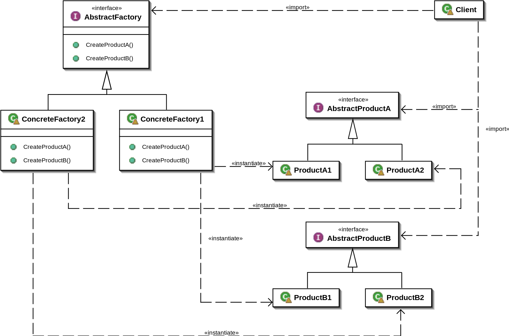

## factory method pattern
 - factory method는 말 그대로 객체를 생성하는 부분을 캡슐화한 패턴이다.
 - 예제에서는 팩토리메서드 패턴 내에서 IPerson인터페이스를 상속받은 Villeager, CityPerson을 이용해서 객체를 생성한다.
 - 실제 객체의 생성부분을 추상화했다고 볼 수 잇다.
 - UML: 
   - 객체(Product)를 생성하는 Interface가 있고 이를 구체화한 클래스가 있다.
   - factory(creator)에서는 객체(Product)를 생성하는 Interface를 사용해서 객체를 생성한다.
   - factory를 Interface로 구현하고 구체적인 팩터리 패턴을 구현하는 것도 가능하다.
 현재 코드에서는 2개의 Person(Villeager, CityPerson)을 생성하는 로직을 하나의 팩터리에  추가했지만, VilleagerFactory, CityPersonFactory으로 분리해서 구현이 가능하다. 
   - 만약 객체 생성 시에 전달해야하는 인자들이 늘어날 수록, 유지보수에 어려움이 발생할 수 있다. 그래서 추상화하는 것이 더 좋다. 

 
## abstract factory pattern
 - 구체적인 클래스를 지정하지 않고 공통 테마를 가진 개별 팩토리 그룹을 캡슐화하는 방법을 제공한다.   
 - 예제에서는 Client에서 어떤 클래스의 구체적인 인스턴스(IPad인지, Galaxy인지)를 감추고 Interface(IProduct)로 접근한다.
 - Client코드의 구체적인 클래스(Product)에 대한 의존성을 제거한다는 점에서 의미가 있다.
 (client는 구체적인 클래스(product)에 대한 세부 내용을 알 필요가 없으므로..)
 - UML:
   

### 참고
자세한 설명은 Wikipedia의 내용을 참고하자.  
여기서는 내가 실제 구현을 하면서 알게된 것들을 메모하는 걸로..  
https://en.wikipedia.org/wiki/Factory_method_pattern
  
  
## 그 외의 부수적인 지식들..
#### Composition vs Aggregation
https://ttottoro.tistory.com/477
  
Composition, Aggregation은 모두 상속관계이다.  
Composition은 'is A'의 관계로, 전체와 부분이 강력한 연관관계를 맺으며 전체와 부분이 같은 생명 주기를 갖는다.  
(Car와 Engine의 관계처럼)  
Aggregation은 전체와 부분의 연관관계를 맺지만, 동일한 생명주기를 갖지는 않는다.
(Phone과 Address의 관계처럼)  
